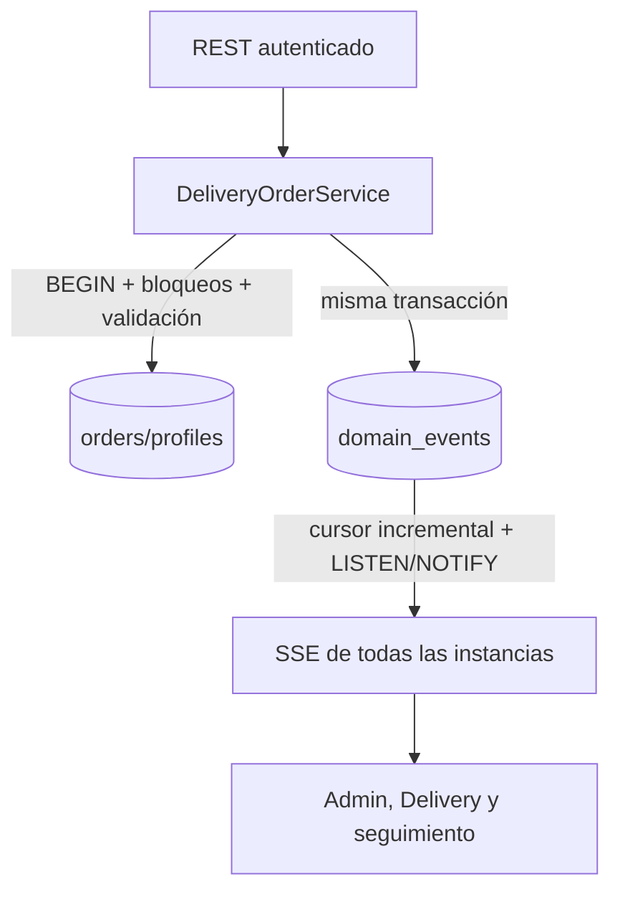
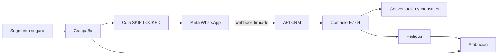

# Arquitectura de Distrito BG

## Fuentes de verdad

- `distrito-web` contiene únicamente la tienda pública.
- `distrito-admin` contiene únicamente el panel autenticado.
- `distrito-delivery` contiene la PWA y la envoltura Android de los domiciliarios.
- `distrito-api` concentra reglas de negocio y acceso a PostgreSQL.
- `distrito-shared` concentra componentes visuales que deben comportarse igual en
  más de una aplicación: dirección exacta, mapa en vivo, mensajes, estados visibles
  y alertas.
- `distrito-api/src/order-rules.js` contiene los valores y transiciones comerciales
  admitidos por el backend.
- `distrito-shared/src/orderFlow.js` contiene únicamente la presentación compartida
  de esos valores: nombre, descripción, tono y color.
- `distrito-api/migrations` es la única fuente de verdad del esquema de base de datos.
- `pedidos_app_crm_contacts.normalized_phone` es la identidad comercial canónica;
  Clientes y Pedidos se enlazan a ella sin duplicar la fuente financiera.
- `src/crm/segments.js` es la única traducción permitida de reglas de segmento a
  SQL parametrizado.
- `src/whatsapp-cloud.js` es la única frontera con WhatsApp Cloud API.
- `VITE_API_URL` siempre representa el origen de la API, sin `/api/pedidos` al final.
- `src/config/api.js` agrega el prefijo `/api/pedidos` en cada frontend.

No deben agregarse sentencias `CREATE TABLE` o `ALTER TABLE` al servidor ni a scripts
independientes. Todo cambio de esquema se agrega como una migración SQL nueva e
inmutable y se aplica con `npm run migrate`.

## Flujo principal

1. Web consulta catálogo, configuración, anuncio y horarios en la API.
2. La API entrega URLs de medios cacheables en lugar de imágenes Base64 dentro del JSON.
3. Web o Admin confirman el destino con el mismo componente de Google Places y
   envían el carrito mínimo junto con dirección, coordenadas, Place ID y detalles
   complementarios del domicilio.
4. La API valida el horario en `America/Bogota`, recupera precios y reserva stock en una sola transacción.
5. Web sigue el pedido con el identificador confirmado y el teléfono del cliente.
6. Admin gestiona pedidos, productos, stock, contabilidad, configuración y seguridad
   sobre la misma API. Una cuenta de reparto no puede atravesar la frontera `/admin`
   salvo para leer el tema visual compartido.
7. Delivery inicia turno, consume pedidos `Listo`, acepta de forma atómica, inicia
   el recorrido, comparte GPS durante `En camino` y confirma la entrega.
8. La mutación y su evento se escriben en una transacción. El outbox PostgreSQL
   propaga SSE entre instancias y los clientes resincronizan por REST al reconectar.
9. Los webhooks firmados de Meta crean o actualizan contacto, conversación y
   mensaje de forma idempotente. El mismo outbox notifica Inbox y dashboards.
10. Campañas toman una fotografía del segmento, vuelven a validar consentimiento
    en la cola y atribuyen pedidos completados dentro de la ventana configurada.

## Base de datos

Los productos usan UUID. Pedidos, usuarios, roles y sesiones conservan identificadores
enteros. `pedidos_app_product_stock_movements` relaciona cada variación de stock con
el producto y, cuando corresponde, con el pedido. Las tablas antiguas de ingredientes,
recetas y lotes se conservan únicamente como histórico y no participan en el flujo vigente.

Las credenciales permanecen exclusivamente en `.env`. Los scripts de diagnóstico y
migración usan `src/db.js`; no deben incluir cadenas de conexión propias.

La clave de navegador de Google Maps es visible en el bundle por definición, pero
su valor local se lee desde un solo `.env` ignorado por Git y debe protegerse con
restricciones de referente y de API en Google Cloud. Nunca se usan variables
`VITE_*` para credenciales de PostgreSQL, JWT, SMTP o VAPID privado.

El reparto amplía `pedidos_app_orders` con responsable, versión optimista,
`delivery_status` y marcas de tiempo. La orden guarda el destino confirmado en
`delivery_latitude`/`delivery_longitude` y `delivery_place_id`; es la única fuente
para la navegación. `pedidos_app_delivery_profiles` guarda cupo, turno, heartbeat,
dispositivo oficial y última posición. El histórico normalizado vive en
`pedidos_app_driver_location_points`: cada posición pertenece al conductor y al
dispositivo, no se duplica por cada pedido simultáneo.

`status` continúa siendo la fase comercial y `delivery_status` la fase logística.
`src/delivery-domain.js` define la relación admitida. Las operaciones críticas usan
bloqueos de fila, `version` e idempotencia; las rutas genéricas no pueden saltarse
esa capa. Las evidencias binarias, excepciones de geocerca y eventos de dominio
tienen tablas separadas para no inflar ni desnormalizar el pedido.



El servicio Android no recibe el JWT completo de la sesión. Un código de un solo
uso vinculado a conductor/dispositivo se intercambia dentro del plugin por un token
GPS limitado y se almacena con Android Keystore. La PWA web usa el token de sesión,
pero ambos canales ingresan por `DeliveryLocationService`.

## CRM y WhatsApp

El módulo histórico `pedidos_app_customers` continúa existiendo. La tabla puente
`pedidos_app_crm_contact_customers` resuelve duplicados históricos sin fusionar ni
borrar datos. Las métricas CRM se refrescan desde `pedidos_app_orders`; pedidos
cancelados o rechazados no suman compras ni ingresos.

La recepción de WhatsApp verifica HMAC SHA-256 sobre el cuerpo original. El
endpoint persiste primero una huella y el payload, devuelve HTTP 200 y procesa el
evento fuera del ciclo de respuesta; el worker recupera eventos `RECEIVED` si la
instancia se reinicia. Los eventos y mensajes tienen claves únicas. La salida usa una cola PostgreSQL con
`SKIP LOCKED`, reintento exponencial ante rechazo confirmado y fallo manual ante
entrega incierta para no duplicar comunicaciones. Texto libre requiere una entrada
del cliente dentro de 24 horas; las campañas requieren plantilla aprobada.



Consulta el contrato completo en
[`../distrito-docs/CRM_WHATSAPP_2026-08-09.md`](../distrito-docs/CRM_WHATSAPP_2026-08-09.md).

## Operación

```text
npm run migrate     # aplica migraciones pendientes
npm run db:analyze  # actualiza estadísticas de las tablas de mayor uso
npm run db:prune     # retención de GPS, eventos y datos operativos CRM
npm test            # valida el contrato del esquema
npm run check       # valida sintaxis de la API
```

El endpoint `/api/pedidos/health` expone solo señales operativas: PostgreSQL,
outbox, conexiones SSE, turnos y GPS reciente. Los logs estructurados incluyen un
`request_id` y contexto de usuario/pedido/dispositivo, nunca tokens. Durante la
conexión inicial con Meta, `WHATSAPP_WEBHOOK_LOG_PAYLOAD=true` registra el cuerpo
de webhooks con firma válida; debe desactivarse después de comprobar la integración.
